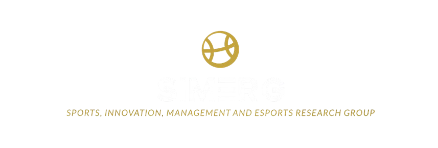

# SIMERG

<div align="center">
  
  <br />
  <br />
  
  [](https://nextjs.org/)
  [](https://reactjs.org/)
  [](https://tailwindcss.com/)
  [](https://next-auth.js.org/)
  [](https://www.emailjs.com/)
  
  [](LICENSE)
  [](https://vercel.com/)
</div>

## 🚀 About

SIMERG (Sports Innovation Management and Esports Research Group) represents a dynamic research group specializied in sports and esports management through innovative information systems and cutting-edge research. Covering a diverse variety of topics our group brings together a team of researchers with a wide range of expertise. Our collaborative approach enables us to explore these themes comprehensively and develop innovative solutions across various domains within sports and esports management.
Our platform serves as a central hub for researchers, practitioners, and students interested in the intersection of sports and esports management, technology, and academic research.

### 🎯 Mission

**Our mission is to:**

- Foster collaboration between academic researchers and sports industry professionals
- Develop and implement innovative solutions for sports management challenges
- Share knowledge and research findings with the global sports community
- Support the next generation of sports management researchers and practitioners
- Bridge the gap between theoretical research and practical applications in sports management

Through our platform, we aim to create a dynamic ecosystem where research meets practice, enabling the advancement of sports management knowledge and methodologies.

## ✨ Features

- 🔐 Authentication with GitHub and Google
- 📱 Responsive design with Tailwind CSS
- 📚 Project showcase with categorization
- 📰 News and initiatives management
- 👥 Team member profiles
- 📧 Contact form with EmailJS integration
- 🔄 Dynamic routing
- 🎨 Modern UI/UX design

## 🛠️ Tech Stack

- **Framework:** Next.js 14 with App Router
- **Frontend:** React 18, Tailwind CSS
- **Authentication:** NextAuth.js
- **Email:** EmailJS
- **Styling:** Tailwind CSS
- **Icons:** React Icons
- **Notifications:** React Hot Toast

## 📝 Getting Started

### Prerequisites

- Node.js (v18 or higher)
- npm or yarn
- Git

### Installation

1. Clone the repository

```bash
git clone https://github.com/your-username/simerg.git
cd simerg
```

2. Install dependencies

```bash
npm install
# or
yarn install
```

3. Set up environment variables

```bash
cp .env.local.example .env.local
```

4. Configure your environment variables in `.env.local`:

```env
# EmailJS Configuration
NEXT_PUBLIC_EMAILJS_SERVICE_ID=
NEXT_PUBLIC_EMAILJS_TEMPLATE_ID=
NEXT_PUBLIC_EMAILJS_PUBLIC_KEY=

# EmailJS
NEXT_PUBLIC_EMAILJS_SERVICE_ID=
NEXT_PUBLIC_EMAILJS_TEMPLATE_ID=
NEXT_PUBLIC_EMAILJS_PUBLIC_KEY=

# Next Auth
NEXTAUTH_URL=
NEXTAUTH_SECRET=

# Github Provider
GITHUB_ID=
GITHUB_SECRET=

# Google Provider
GOOGLE_CLIENT_ID=
GOOGLE_CLIENT_SECRET=

```

5. Run the development server

```bash
npm run dev
# or
yarn dev
```

Visit [http://localhost:3000](http://localhost:3000) to see the application.

## 📁 Project Structure

```
simerg/
├── app/                  # Next.js 14 app directory
│   ├── api/              # API routes
│   ├── context/          # React context providers
│   └── [...routes]/      # Page routes
├── components/           # React components
├── public/
│   ├── Initiatives/      # Initiatives images
│   ├── Logos/            # Project logos
│   ├── News/             # News images
│   ├── Partners/         # Partner logos
│   ├── Projects/         # Project assets
│   └── Team/             # Team member photos
└── utils/                # Utility functions
```

## 🔒 Authentication

The project uses NextAuth.js for authentication with multiple providers:

- GitHub OAuth
- Google OAuth
- Credentials (email/password)

To configure authentication:

1. Set up OAuth applications in GitHub and Google developer consoles
2. Add the credentials to your `.env.local` file
3. Configure callback URLs in your OAuth providers:
   - GitHub: `http://localhost:3000/api/auth/callback/github`
   - Google: `http://localhost:3000/api/auth/callback/google`

## 🎯 Roadmap

- [ ] Dark/Light mode implementation
- [ ] Internationalization support
- [ ] Enhanced team member project linking
- [ ] PDF integration for master's projects
- [ ] Improved mobile navigation
- [ ] Page-specific metadata
- [ ] Performance optimizations

## 🤝 Contributing

Contributions are welcome! Please feel free to submit a Pull Request.

1. Fork the project
2. Create your feature branch (`git checkout -b feature/amazing-feature`)
3. Commit your changes (`git commit -m 'Add some AmazingFeature'`)
4. Push to the branch (`git push origin feature/amazing-feature`)
5. Open a Pull Request

## 📄 License

This project is licensed under the MIT License - see the [LICENSE](LICENSE) file for details.

## 🙏 Acknowledgments

- [Next.js](https://nextjs.org/)
- [Tailwind CSS](https://tailwindcss.com/)
- [NextAuth.js](https://next-auth.js.org/)
- [EmailJS](https://www.emailjs.com/)
